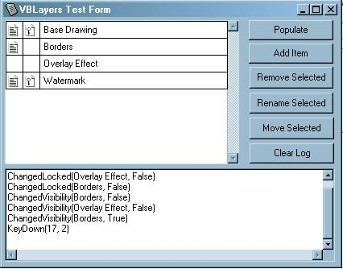



## VBLayers ActiveX Control

### Description

VBLayers is an ActiveX Control that will create a Layers Window, similar to that in Adobe Photoshop (see Screenshot). Features dragable layers, automatic scrolling, drag tracking and more. Very well commented and clean code. I welcome any feedback towards making this a better product, and appreciate any votes. (Note: Archive corrected to contain image references for project.)
 
### More Info
 
Tested on Windows 2000 and Windows 95.

None known at this time.

             |
---                |---
**Submitted On**   |2002-10-19 06:13:02
**By**             |[Joseph M\. Ferris](https://github.com/Planet-Source-Code/PSCIndex/blob/master/ByAuthor/joseph-m-ferris.md)
**Level**          |Advanced
**User Rating**    |4.9 (34 globes from 7 users)
**Compatibility**  |VB 6\.0
**Category**       |[Custom Controls/ Forms/  Menus](https://github.com/Planet-Source-Code/PSCIndex/blob/master/ByCategory/custom-controls-forms-menus__1-4.md)
**World**          |[Visual Basic](https://github.com/Planet-Source-Code/PSCIndex/blob/master/ByWorld/visual-basic.md)
**Archive File**   |[VBLayers\_A14839610192002\.zip](https://github.com/Planet-Source-Code/joseph-m-ferris-vblayers-activex-control__1-39948/archive/master.zip)

### API Declarations

Provided in the Archive.

